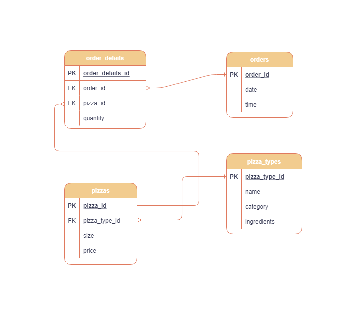

# SQL Project: Pizza Store Analysis
Read the full detailed article here.

## Description
This project uses SQL to analyze the dataset of a pizza store. The goal of the project is to answer a set of business-related questions to help the store make better decisions for improving sales and optimizing performance.

## Installation
To run this project on your machine, follow the steps below:

1. Install a SQL-supported DBMS (e.g., PostgreSQL, MySQL, or SQLite).
2. Create a database.
3. Create tables using the schema diagram provided below.
4. Import the CSV files.
   

## Schema Diagram

## Database and Tools
- **PostgreSQL**
- **PgAdmin4**

## Questions Answered
The following are a few of the questions answered in the project:

1. What is the percentage contribution of each pizza type to total revenue?
2. What is the distribution of orders by the hour of the day?
3. What are the total quantities of each pizza category ordered?
4. How can dynamic discounts be applied based on the order value?
5. What is the cumulative revenue generated over time?

## Results
The key insights from the project are:

1. The percentage contribution of each pizza type to total revenue was calculated, helping the store identify its top sellers.
2. The busiest hours for pizza orders were determined, allowing for better staff scheduling.
3. The pizza category with the highest total sales: **Classic**, guiding inventory management.
4. Dynamic discounts were applied to promote higher-value orders, optimizing promotions..
5. The cumulative revenue over time analysis provided insights into revenue growth trends.

## Conclusion
The project successfully answered a set of key business questions for the pizza store. The insights can be leveraged to make informed decisions regarding sales strategies, product offerings, and marketing campaigns.
